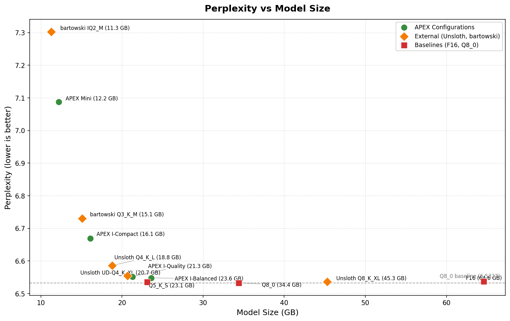
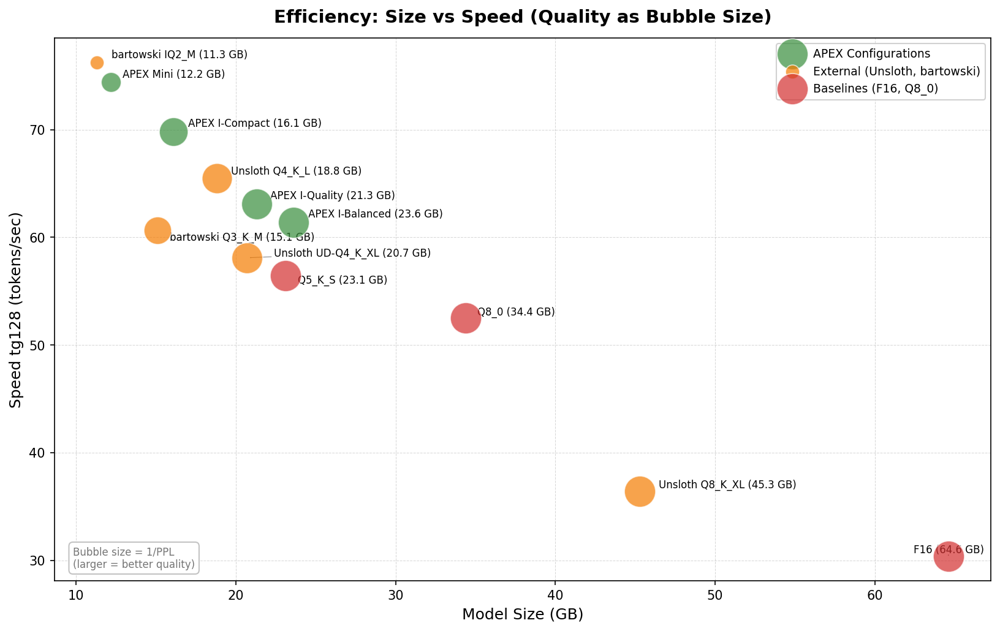
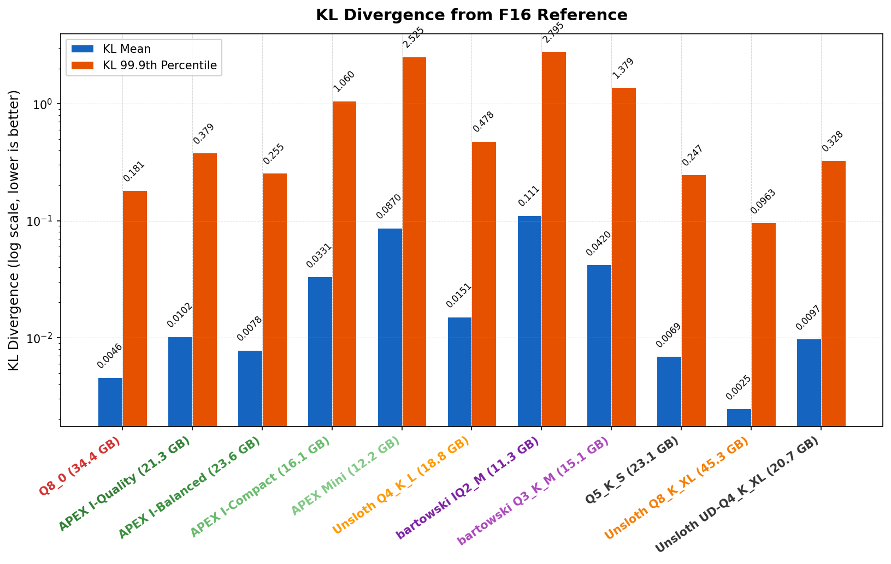

# APEX -- Adaptive Precision for EXpert Models

**Brought to you by the [LocalAI](https://github.com/mudler/LocalAI) team** -- the creators of LocalAI the open-source AI engine that runs any model - LLMs, vision, voice, image, video - on any hardware. No GPU required.

[](paper/APEX_Technical_Report.pdf)
[](https://huggingface.co/mudler/Qwen3.5-35B-A3B-APEX-GGUF)
[](LICENSE)
[](https://github.com/mudler/LocalAI)

**A novel MoE-aware mixed-precision quantization technique for [llama.cpp](https://github.com/ggerganov/llama.cpp)**

*Beats Q8_0 perplexity at half the size -- and even beats F16.* APEX outperforms Unsloth Dynamic 2.0 (UD) quantizations on perplexity, HellaSwag, and inference speed while being **2x smaller**: APEX I-Quality (21.3 GB) achieves PPL 6.552 and 83.5% HellaSwag vs Unsloth UD-Q8_K_XL (45.3 GB) at PPL 6.536 and 82.5% HellaSwag. At the consumer tier, APEX Mini (12.2 GB) beats bartowski IQ2_M on every metric.

APEX assigns quantization precision per tensor type and per layer, exploiting the structural sparsity of Mixture-of-Experts models to achieve lossless compression that uniform quantization cannot. Five tiers from 21.3 GB (I-Quality) to 12.2 GB (Mini) cover every deployment scenario from maximum accuracy to consumer GPU inference. I-variants use a diverse imatrix (chat, code, reasoning, tool-calling -- no Wikipedia) that trades tiny perplexity increases for significant accuracy gains and lower KL divergence.

---

## What is APEX?

APEX is a quantization strategy for Mixture-of-Experts (MoE) models that goes beyond uniform bit-width assignment. It classifies every tensor by its role -- routed expert, shared expert, or attention -- and then applies a layer-wise precision gradient, giving the most sensitive edge layers higher precision and compressing the redundant middle layers more aggressively. The result is a set of GGUF quantizations that match or beat full Q8_0 quality at a fraction of the size and with faster inference, all using stock llama.cpp with no code changes.

## Results

All measurements on Qwen3.5-35B-A3B, NVIDIA DGX Spark (GB10, 122 GB VRAM). Perplexity measured on wikitext-2-raw, context 2048. Accuracy benchmarks (HellaSwag, Winogrande, MMLU, ARC-Challenge, TruthfulQA) evaluated via llama.cpp using 400 tasks where applicable.

### Core Metrics

| Configuration | Size (GB) | Perplexity | KL mean | KL max | HS | WG | MMLU | ARC | TQA | tg128 (t/s) |
|---------------|-----------|-----------|---------|--------|------|------|------|------|------|-------------|
| F16 | 64.6 | 6.537 | -- | -- | 82.5% | 74.5% | 41.5% | 56.9% | 37.2% | 30.4 |
| Q8_0 | 34.4 | 6.533 | 0.0046 | 14.71 | 83.0% | 75.3% | 41.2% | 57.9% | 37.7% | 52.5 |
| **APEX Quality** | **21.3** | **6.527** | **0.0114** | **5.85** | **83.0%** | **74.5%** | **41.2%** | **56.2%** | **37.7%** | **62.3** |
| **APEX I-Quality** | **21.3** | **6.552** | **0.0102** | **5.59** | **83.5%** | **74.5%** | **41.4%** | **57.9%** | **38.4%** | **63.1** |
| **APEX Balanced** | **23.6** | **6.533** | **0.0088** | **6.03** | **83.0%** | **74.5%** | **41.3%** | **56.9%** | **36.8%** | **60.8** |
| **APEX I-Balanced** | **23.6** | **6.548** | **0.0078** | **5.77** | **83.0%** | **73.3%** | **41.0%** | **57.5%** | **37.5%** | **61.4** |
| **APEX Compact** | **16.1** | **6.783** | **0.0469** | **7.56** | **82.5%** | **73.3%** | **40.9%** | **55.2%** | **36.5%** | **69.8** |
| **APEX I-Compact** | **16.1** | **6.669** | **0.0332** | **5.50** | **81.8%** | **75.0%** | **41.7%** | **55.5%** | **37.9%** | **69.8** |
| **APEX Mini** | **12.2** | **7.088** | **0.0870** | **5.57** | **81.0%** | **75.5%** | **41.3%** | **57.2%** | **36.7%** | **74.4** |
| Unsloth UD-Q8_K_XL | 45.3 | 6.536 | 0.0025 | 4.36 | 82.5% | 74.8% | 41.3% | 57.9% | 38.1% | 36.4 |
| Unsloth UD-Q4_K_L | 18.8 | 6.586 | 0.0151 | 5.98 | 82.3% | 75.8% | 41.1% | 59.2% | 37.3% | 65.5 |
| bartowski IQ2_M | 11.3 | 7.303 | 0.1113 | 6.07 | 80.3% | 74.0% | 39.6% | 56.2% | 35.0% | 76.2 |
| bartowski Q3_K_M | 15.1 | 6.730 | 0.0420 | 5.56 | 82.0% | 75.0% | 41.5% | 57.5% | 38.8% | 60.6 |

### Benchmark Plots









### Key Takeaways

- **APEX Quality has the best perplexity of any quantization** (6.527, beats even F16's 6.537) and the lowest KL max among APEX tiers (5.85), at just 21.3 GB.
- **I-variants trade tiny PPL increases for significant accuracy gains.** I-Quality achieves 83.5% HellaSwag (best of any model), 57.9% ARC, and 38.4% TruthfulQA. KL divergence is consistently 10-30% lower across all I-variants.
- **I-Compact is the biggest imatrix winner**: PPL drops from 6.783 to 6.669 (-0.114), KL max from 7.56 to 5.50, MMLU from 40.9% to 41.7%.
- **APEX Mini (12.2 GB) beats bartowski IQ2_M (11.3 GB) on every metric**: PPL 7.088 vs 7.303, HellaSwag 81.0% vs 80.3%, MMLU 41.3% vs 39.6%. Layer gradient + IQ2_S with diverse imatrix outperforms uniform IQ2_M.
- **At similar size (18.8 vs 21.3 GB), APEX Quality beats Unsloth UD-Q4_K_L** on perplexity (6.527 vs 6.586), KL mean (0.011 vs 0.015), and HellaSwag (83.0% vs 82.3%).
- **APEX Compact (16.1 GB) is 14% smaller than Unsloth UD-Q4_K_L (18.8 GB) and 7% faster** (69.8 vs 65.5 t/s), fitting consumer 24 GB GPUs with room for context.
- **Unsloth UD-Q8_K_XL wins on KL divergence** (best mean 0.0025, best max 4.36) but at 2-3x the size of APEX tiers.
- **Q8_0 has the worst outlier divergence** of all models tested (KL max 14.71), despite a low KL mean -- showing that uniform quantization can produce extreme outliers.
- **All APEX tiers match or beat Unsloth on accuracy benchmarks** within noise, at a fraction of the size.

## Benchmark Suite

APEX evaluation covers two categories of metrics:

**Information-theoretic metrics** measure how closely the quantized model's output distribution matches the original:
- **Perplexity** (wikitext-2-raw, context 2048): Standard language modeling metric. Lower is better.
- **KL Divergence**: Measures the divergence between quantized and full-precision logit distributions. Reported as mean, max, 99.9th percentile, and median. Lower means the quantized model's predictions more closely match the original. Max KL reveals worst-case outlier divergence.

**Downstream accuracy benchmarks** measure task performance directly:
- **HellaSwag** (400 tasks): Commonsense reasoning via sentence completion.
- **Winogrande** (400 tasks): Coreference resolution requiring world knowledge.
- **MMLU**: Multitask language understanding across 57 academic subjects.
- **ARC-Challenge**: Grade-school science questions (challenge set).
- **TruthfulQA**: Measures tendency to generate truthful answers.

Evaluations on hybrid MoE models (HellaSwag, Winogrande, MMLU, ARC-Challenge, TruthfulQA) were enabled by our upstream fix to llama.cpp's hybrid memory path for recurrent architectures (PR-ready). Without this fix, llama.cpp would crash when running these evaluations on models like Qwen3.5-35B-A3B that use both attention and SSM blocks.

## Quick Start

```bash
# Clone the repo
git clone https://github.com/mudler/apex-quant.git
cd apex-quant

# Quantize a model (requires an F16 GGUF and llama.cpp built)
# APEX I-Quality (recommended -- best accuracy across benchmarks)
./scripts/quantize.sh --i-quality model-f16.gguf model-apex-i-quality.gguf

# APEX Quality (best perplexity of any quantization)
./scripts/quantize.sh --quality model-f16.gguf model-apex-quality.gguf

# APEX I-Balanced / Balanced (best all-rounder)
./scripts/quantize.sh --i-balanced model-f16.gguf model-apex-i-balanced.gguf
./scripts/quantize.sh --balanced model-f16.gguf model-apex-balanced.gguf

# APEX I-Compact / Compact (consumer 24 GB GPUs)
./scripts/quantize.sh --i-compact model-f16.gguf model-apex-i-compact.gguf
./scripts/quantize.sh --compact model-f16.gguf model-apex-compact.gguf

# APEX Mini (consumer 16 GB VRAM, smallest viable)
./scripts/quantize.sh --mini model-f16.gguf model-apex-mini.gguf
```

Or run the full pipeline from a HuggingFace model ID:

```bash
./scripts/quantize.sh --full-pipeline Qwen/Qwen3.5-35B-A3B
```

## How It Works

APEX exploits three properties of MoE models to achieve lossless compression:

### 1. MoE-aware tensor classification

Not all tensors in an MoE model are equal. APEX classifies them into three categories with different precision requirements:

- **Routed expert weights** (gate/up/down projections): These make up the bulk of model parameters but only 8 out of 256 experts are active per token. The 97% sparsity means these tolerate aggressive quantization -- the routing decision uses full-precision gate weights, so quantization noise in inactive experts never affects output.
- **Shared expert weights**: Always active for every token and exhibit heavy-tailed weight distributions (kurtosis 13.10 vs 3.41 for routed experts). These need high precision (Q8_0) to preserve outlier values.
- **Attention and SSM weights**: Dense layers that contribute few parameters but matter for generation quality. Kept at Q6_K uniformly.

### 2. Layer-wise precision gradient

Edge transformer layers (the first and last 5) handle input embedding alignment and output logit generation. They are significantly more sensitive to quantization than the middle layers, which perform more redundant intermediate processing. APEX assigns higher precision to the edges and lower precision to the middle:

- **Edge layers (L0-4, L35-39)**: Q6_K for routed experts (6.6 bits/weight)
- **Near-edge layers (L5-9, L30-34)**: Q5_K for routed experts (5.5 bits/weight)
- **Middle layers (L10-29)**: Q4_K or IQ4_XS for routed experts (4.25-4.5 bits/weight)

### 3. Five tiers

| Configuration | Size | Expert strategy | Best for |
|---------------|------|----------------|----------|
| **APEX I-Quality** | 21.3 GB | 3-tier gradient with IQ4_XS middle, diverse imatrix | Best accuracy across benchmarks |
| **APEX Quality** | 21.3 GB | 3-tier gradient with IQ4_XS middle layers | Lowest perplexity of any quantization |
| **APEX I-Balanced** | 23.6 GB | 2-tier gradient (Q6_K edges, Q5_K middle), diverse imatrix | All-round with lower KL divergence |
| **APEX Balanced** | 23.6 GB | 2-tier gradient (Q6_K edges, Q5_K middle) | Interactive use, serving, general purpose |
| **APEX I-Compact** | 16.1 GB | Q4_K edges, Q3_K middle, diverse imatrix | 16 GB GPUs, best accuracy at this size |
| **APEX Compact** | 16.1 GB | Q4_K edges (L0-4, L35-39), Q3_K middle (L5-34), Q6_K shared, Q4_K attn | Consumer 24 GB GPUs, fastest inference |
| **APEX Mini** | 12.2 GB | Layer gradient with IQ2_S middle, diverse imatrix | Consumer 16 GB VRAM, smallest viable |

### 4. I-variants: diverse imatrix calibration

Standard imatrix calibration uses Wikipedia text, which biases quantization toward encyclopedic prose. APEX I-variants use a diverse calibration dataset spanning chat, code, reasoning, and tool-calling -- no Wikipedia. This produces a different optimization tradeoff: I-variants trade a tiny perplexity increase on wikitext (the benchmark Wikipedia text) for significant gains on real-world accuracy benchmarks and consistently lower KL divergence.

The effect is most dramatic on aggressive quantizations. I-Compact drops perplexity from 6.783 to 6.669 (-0.114), reduces KL max from 7.56 to 5.50, and lifts MMLU from 40.9% to 41.7%. At the Quality tier, I-Quality achieves the highest HellaSwag score of any model tested (83.5%), matches Q8_0 on ARC (57.9%), and posts the best TruthfulQA (38.4%).

### 5. APEX Mini: the 12 GB tier

APEX Mini combines the layer-wise precision gradient with IQ2_S middle-layer experts and a diverse imatrix to push MoE quantization to 12.2 GB. At this size it fits consumer 16 GB VRAM GPUs (RTX 4060 Ti 16GB, RTX 5060 Ti) with room for context. It beats bartowski IQ2_M (11.3 GB) on every single metric: PPL 7.088 vs 7.303, HellaSwag 81.0% vs 80.3%, MMLU 41.3% vs 39.6%, ARC 57.2% vs 56.2%. The layer gradient + diverse imatrix combination outperforms uniform quantization even at extreme compression ratios.

## Key Findings

These findings emerged from 25+ systematic experiments across quantization strategies, precision levels, and layer configurations:

- **Q6_K is the sweet spot for routed experts.** Going from Q6_K to Q8_0 on expert weights wastes 7.5 GB for zero perplexity improvement. Going below Q5_K causes measurable degradation.
- **Layer position matters more than uniform bit-width.** A 2-tier layer gradient (Q6_K edges, Q5_K middle) matches Q8_0 quality. A uniform Q5_K assignment does not.
- **Shared expert precision is critical.** The shared expert's heavy-tailed weight distribution (kurtosis 13.10) makes it the most sensitive component. Q8_0 is the minimum viable precision.
- **IQ formats underperform K-quants for MoE experts.** IQ3_S gives worse perplexity than Q3_K on routed expert tensors despite similar bit rates, because the near-Gaussian expert weight distribution (kurtosis 3.41) is better handled by K-quant block structure.
- **Diverse imatrix calibration improves real-world accuracy.** A calibration dataset spanning chat, code, reasoning, and tool-calling (no Wikipedia) trades tiny wikitext perplexity increases for significant gains on downstream benchmarks and consistently lower KL divergence. The effect is strongest on aggressive quantizations.
- **Stock llama.cpp quantization algorithms are already optimal.** Five novel C-level modifications (error feedback, enhanced scale search, super-block refinement, Gaussian-density weighting) all showed zero improvement. Gains come from better precision allocation, not algorithm changes.
- **Speed depends on format choice and model size.** All APEX tiers achieve 60+ t/s thanks to reduced model sizes improving cache utilization. APEX Mini reaches 74.4 t/s -- the fastest of all configurations -- at just 12.2 GB.

## Supported Models

APEX works with any MoE model that can be converted to GGUF via llama.cpp. The quantization strategy uses llama.cpp's `--tensor-type-file` flag for per-layer precision assignments and `--tensor-type` for component-level assignments. No patches or custom builds required.

The default configuration targets models with 40 transformer layers (e.g., Qwen3.5-35B-A3B). For models with different layer counts, set the `NUM_LAYERS` environment variable and the scripts will adjust the edge/middle layer boundaries automatically.

## Hardware

All benchmarks were measured on an NVIDIA DGX Spark:

- **GPU**: NVIDIA GB10, 122 GB unified VRAM
- **CUDA**: 13.0, compute capability 12.1
- **Benchmark**: wikitext-2-raw test set, context length 2048, full dataset evaluation
- **Inference speed**: measured with llama-perplexity (prompt processing throughput)

## Run locally with LocalAI

APEX quantized models work out of the box with [LocalAI](https://github.com/mudler/LocalAI) -- a free, open-source OpenAI-compatible API that runs locally. Load any APEX GGUF and get an instant API server with chat completions, embeddings, and more:

```bash
# Run APEX Balanced with LocalAI
local-ai run mudler/Qwen3.5-35B-A3B-APEX-GGUF@Qwen3.5-35B-A3B-APEX-Balanced.gguf
```

LocalAI supports GPU acceleration, multiple model loading, and function calling. See the [LocalAI documentation](https://localai.io) for more.

## TurboQuant KV Cache Compression (Optional)

For additional memory savings and faster prompt processing, APEX models can be combined with KV cache compression via [TurboQuant+](https://github.com/TheTom/llama-cpp-turboquant), a fork of llama.cpp that adds turbo quantization types for the KV cache. This is separate from weight quantization -- TurboQuant compresses the KV cache 4.6x, allowing longer contexts in less VRAM.

This requires the `feature/turboquant-kv-cache` branch of the TurboQuant+ fork:

```bash
# Build (same as llama.cpp, but clone the fork)
git clone https://github.com/TheTom/llama-cpp-turboquant.git
cd llama-cpp-turboquant
git checkout feature/turboquant-kv-cache
cmake -B build -DGGML_CUDA=ON
cmake --build build --config Release -j
```

Recommended configuration: `-ctk q8_0 -ctv turbo3 -fa on`

```bash
# Example: APEX Mini with TurboQuant KV cache compression
./build/bin/llama-server -m Qwen3.5-35B-A3B-APEX-Mini.gguf \
    -ctk q8_0 -ctv turbo3 -fa on \
    --host 0.0.0.0 --port 8080 -ngl 99
```

### Prompt Processing Speedup at 8K Context

| Model | pp8192 baseline | pp8192 turbo3 | Speedup | tg128 delta |
|-------|----------------|---------------|---------|-------------|
| APEX I-Quality | 1,752 t/s | 2,003 t/s | +14.3% | <1% |
| APEX I-Balanced | 1,695 t/s | 1,927 t/s | +13.7% | <1% |
| APEX I-Compact | 1,714 t/s | 1,959 t/s | +14.3% | <1% |
| APEX Mini | 1,696 t/s | 1,938 t/s | +14.3% | <1% |

TurboQuant delivers 13-14% prompt processing speedup at 8K context with negligible impact on token generation speed (<1% delta on tg128). The KV cache compression is orthogonal to weight quantization, so all quality metrics (perplexity, accuracy, KL divergence) remain unchanged.

APEX Mini + TurboQuant enables running a 35B MoE model at 12 GB with 8K+ context on 16 GB VRAM GPUs.

## Credits

APEX is brought to you by the [LocalAI](https://github.com/mudler/LocalAI) team -- the creators of LocalAI the open-source AI engine that runs any model - LLMs, vision, voice, image, video - on any hardware. No GPU required.

Developed through human-driven, AI-assisted research, systematically exploring MoE quantization strategies across 25+ experiments. Built on [llama.cpp](https://github.com/ggerganov/llama.cpp) by Georgi Gerganov and contributors. Inspired by [karpathy/autoresearch](https://github.com/karpathy/autoresearch).

As part of this work, [we contributed an upstream fix to llama.cpp's hybrid memory path for recurrent architectures](https://github.com/ggml-org/llama.cpp/pull/21224). This fix enables running accuracy benchmarks (HellaSwag, Winogrande, MMLU, ARC-Challenge, TruthfulQA) on hybrid MoE models that use both attention and SSM blocks, which previously caused crashes during evaluation.

## Citation

If you use APEX in your research, please cite:

```bibtex
@misc{apex-quant-2026,
    title   = {APEX: Adaptive Precision for Expert Models -- MoE-Aware Mixed-Precision Quantization},
    author  = {Di Giacinto, Ettore and Richard Palethorpe},
    year    = {2026},
    url     = {https://github.com/mudler/apex-quant},
    note    = {Layer-wise precision gradient quantization for Mixture-of-Experts models using llama.cpp}
}
```

```bibtex
@misc{localai,
    title   = {LocalAI: the free, Open Source OpenAI alternative},
    author  = {Di Giacinto, Ettore and {LocalAI Contributors}},
    year    = {2023},
    url     = {https://github.com/mudler/LocalAI}
}
```

## License

MIT License. See [LICENSE](LICENSE) for details.
